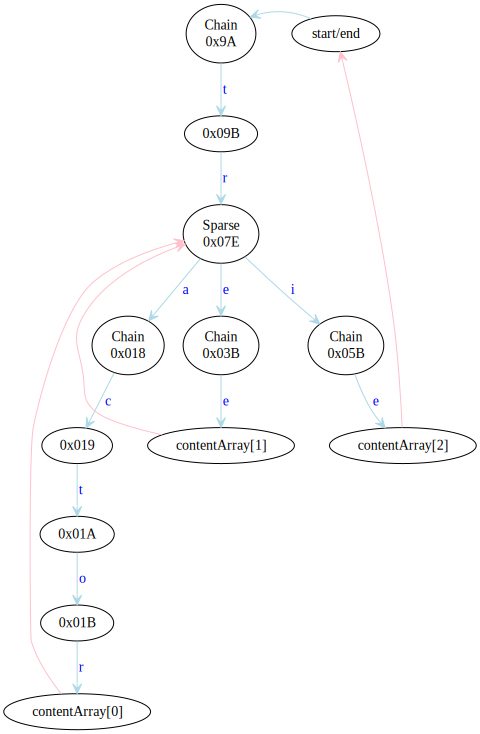
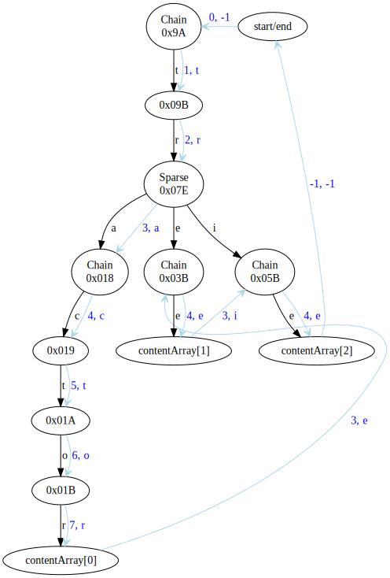
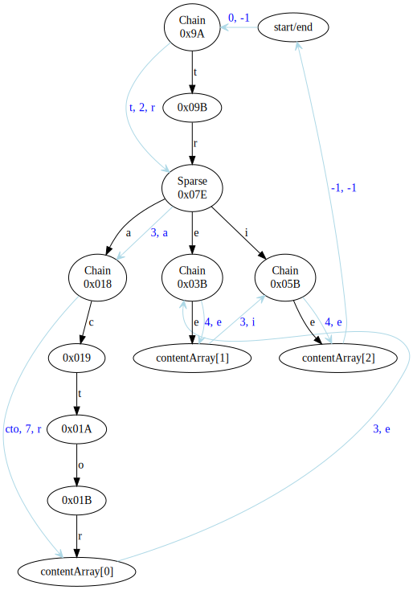

<!---
 Licensed to the Apache Software Foundation (ASF) under one
 or more contributor license agreements.  See the NOTICE file
 distributed with this work for additional information
 regarding copyright ownership.  The ASF licenses this file
 to you under the Apache License, Version 2.0 (the
 "License"); you may not use this file except in compliance
 with the License.  You may obtain a copy of the License at
 
     http://www.apache.org/licenses/LICENSE-2.0
 
 Unless required by applicable law or agreed to in writing, software
 distributed under the License is distributed on an "AS IS" BASIS,
 WITHOUT WARRANTIES OR CONDITIONS OF ANY KIND, either express or implied.
 See the License for the specific language governing permissions and
 limitations under the License.
-->

# `Trie` interface

Tries in apippi are used to represent key-value mappings in an efficient way, currently only for the partition map
in a memtable. The design we use is focussed on performing the equivalent of a read query, being able to most efficiently:
- combine multiple sources while maintaining order,
- restrict the combination to a range of keys,
- efficiently walk the result and extract all covered key-value combinations.

For this the `Trie` interface provides the following public methods:
- Consuming the content using `forEachValue` or `forEachEntry`.
- Conversion to iterable and iterator using `values/valuesIterator` and `entrySet/entryIterator`.
- Getting a view of the subtrie between a given pair of bounds using `subtrie`.
- Merging two or multiple tries together using `mergeWith` and the static `merge`.
- Constructing `singleton` tries representing a single key-to-value mapping.

The internal representation of a trie is given by a `Cursor`, which provides a method of walking the nodes of the trie 
in order, and to which various transformations like merges and intersections can be easily and efficiently applied.
The sections below detail the motivation behind this design as well as the implementations of the basic operations.

## Walking a trie

Walking a `Trie` is achieved using a cursor. Before we describe it in detail, let's give a quick example of what a
classic trie walk looks like and how it can be optimized. Suppose we want to walk the following trie:

(Note: the node labels are `InMemoryTrie` node IDs which can be ignored here, with the exception of `contentArray[x]` 
ones which specify that the relevant node has some associated content.)

The classic walk descends (light blue) on every character and backtracks 
(pink) to the parent, resulting in the following walk:

One can see from this graph that many of the backtracking steps are only taken so that they can immediately be followed
by another backtracking step. We often also know in advance that a node does not need to be examined further on the way
back: if it only has one child (which is always the case for all nodes in a `Chain`), or if we are descending into 
its last child (which is easy to check for `Sparse` nodes). This simplifies the walk to:

In addition to making the walk simpler, shortening the backtracking paths means a smaller walk state representation,
which is quite helpful in keeping the garbage collection cost down. In this example, the backtracking state of the walk
at the "tractor" node is only `[("tr", child 2)]`, changes to `[("tr", child 3)]` on descent to "tre", and becomes empty
(as "tr" has no further children and can be removed) on descent to "tri".  

One further optimization of the walk is to jump directly to the next child without stopping at a branching parent (note:
the black arrows represent the trie structure):

This graph is what a cursor walk over this trie is. Looking closely at the graph, one can see that it stops exactly once
on each node, and that the nodes are visited in lexicographic order. There is no longer a need for a separate backtrack
or ascend operation, because all arrows _advance_ in the representation of the trie. However, to be able to understand
where the next transition character sits in the path, every transition now also comes with information about the
descend-depth it ends in.

To see how this can be used to map the state to a path, we can imagine an array being filled at its `depth-1`th
position on every transition, and the current path being the `depth`-long sequence. This, e.g. the array would hold
[t, r, a, c, t, o, r] at the "tractor" node and change to [t, r, e, c, t, o, r] for the next advance, where the new 
current path is the first 3 characters of the array.

Cursors are stateful objects that store the backtracking state of the walk. That is, a list of all parent nodes in the
path to reach the current node that have further children, together with information which child backtracking should go
to. Cursors do not store paths as these are often not needed &mdash; for example, in a walk over a merged trie it makes 
better sense for the consumer to construct the path instead of having them duplicated in every source cursor. Multiple 
cursors can be constructed and operated in parallel over a trie.

Cursor walks of this type are very efficient but still carry enough information to make it very easy and efficient to
merge and intersect tries. If we are walking a single trie (or a single-source branch in a union trie), we can
improve the efficiency even further by taking multiple steps down in `Chain` nodes, provided we have a suitable
mechanism of passing additional transition characters:

This is supported by `Cursor.advanceMultiple`.

### Why cursors instead of nodes?

The most straightforward representation of a trie is done by giving users every `Node` visited as an object.
Then the consumer can query its transitions, get its children, decide to walk over them in any order it sees
fit, and retain those that it actually needs. This is a very natural and cheap represention if the nodes are actually 
the objects in memory that represent the trie.

The latter is not the case for us: we store tries in integer blobs or files on disk and we present transformed views of
tries. Thus every such `Node` object to give to consumers must be constructed. Also, we only do depth-first walks and it 
does not make that much sense to provide the full flexibility of that kind of interface.

When doing only depth-first walks, a cursor needs far fewer objects to represent its state than a node representation.
Consider the following for an approach presenting nodes:
- In a process that requires single-step descends (i.e. in a merge or intersection) the iteration state must create an
  object for every intermediate node even when they are known to require no backtracking because they have only one
  child. 
- Childless final states require a node.
- A transformation such as a merge must present the result as a transformed node, but it also requires a node for each
  input. If the transformed node is retained, so must be the sources.

Cursors can represent the first two in their internal state without additional backtracking state, and require only one
transformed cursor to be constructed for the entire walk. Additionally, cursors' representation of backtracking state 
may be closely tied to the specific trie implementation, which also gives further improvement opportunities (e.g. the 
`Split` node treatment in `InMemoryTrie`).

### Why not visitors?

A visitor or a push alternative is one where the trie drives the iteration and the caller provides a visitor or a 
consumer. This can work well if the trie to walk is single-source, but requires some form of stop/restart or pull
mechanism to implement ordered merges.

Push-style walks are still a useful way to consume the final transformed/merged content, thus `Trie` provides 
the `Walker` interface and `process` method. The implementations of `forEachEntry` and `dump` are straightforward
applications of this.

### The `Cursor` interface

The cursor represents the state of a walk over the nodes of trie. It provides three main features:
- the current `depth` or descend-depth in the trie;
- the `incomingTransition`, i.e. the byte that was used to reach the current point;
- the `content` associated with the current node,

and provides methods for advancing to the next position.  This is enough information to extract all paths, and
also to easily compare cursors over different tries that are advanced together. Advancing is always done in
order; if one imagines the set of nodes in the trie with their associated paths, a cursor may only advance from a
node with a lexicographically smaller path to one with bigger. The `advance` operation moves to the immediate
next, it is also possible to skip over some items e.g. all children of the current node (`skipChildren`).

Moving to the immediate next position in the lexicographic order is accomplished by:
- if the current node has children, moving to its first child;
- otherwise, ascend the parent chain and return the next child of the closest parent that still has any.

As long as the trie is not exhausted, advancing always takes one step down, from the current node, or from a node
on the parent chain. By comparing the new depth (which `advance` also returns) with the one before the advance,
one can tell if the former was the case (if `newDepth == oldDepth + 1`) and how many steps up we had to take
(`oldDepth + 1 - newDepth`). When following a path down, the cursor will stop on all prefixes.

In addition to the single-step `advance` method, the cursor also provides an `advanceMultiple` method for descending
multiple steps down when this is known to be efficient. If it is not feasible to descend (e.g. because there are no
children, or because getting to the child of the first child requires a page fetch from disk), `advanceMultiple` will
act just like `advance`.

For convenience, the interface also provides an `advanceToContent` method for walking to the next node with non-null
content. This is implemented via `advanceMultiple`.

When the cursor is created it is placed on the root node with `depth() = 0`, `incomingTransition() = -1`. Since
tries can have mappings for empty, `content()` can possibly be non-null in the starting position. It is not allowed
for a cursor to start in exhausted state (i.e. with `depth() = -1`).

### Using cursors in parallel

One important feature of cursors is the fact that we can easily walk them in parallel. More precisely, when we use a 
procedure where we only advance the smaller, or both if they are equal, we can compare the cursors' state by:
- the reverse order of their current depth (i.e. higher depth first),
- if depths are equal, the order of their current incoming transition (lexicographically smaller first).

We can prove this by induction, where for two cursors `a` and `b` we maintain that:
1. for any depth `i < mindepth - 1`, `path(a)[i] == path(b)[i]`
2. if `a.depth < b.depth`, then `path(a)[mindepth - 1] > path(b)[mindepth - 1]`
3. if `a.depth > b.depth`, then `path(a)[mindepth - 1] < path(b)[mindepth - 1]`

where `mindepth = min(a.depth, b.depth)` and `path(cursor)` is the path corresponding to the node the cursor is
positioned at. Note that `path(cursor)[cursor.depth - 1] == cursor.incomingTransition`.

These conditions ensure that `path(a) < path(b)` if and only if `a.depth > b.depth` or `a.depth == b.depth` and 
`a.incomingTransition < b.incomingTransition`. Indeed, if the second part is true then 1 and 3 enforce the first,
and if the second part is not true, i.e. `a.depth <= b.depth` and (`a.depth != b.depth` or 
`a.incomingTransition >= b.incomingTransition`), which entails `a.depth < b.depth` or `a.depth == b.depth` and
`a.incomingTransition >= b.incomingTransition`, then by 2 and 1 we can conclude that `path(a) >= path(b)`, i.e. the
first part is not true either.

The conditions are trivially true for the initial state where both cursors are positioned at the root with depth 0.
Also, when we advance a cursor, it is always the case that the path of the previous state and the path of the new state 
must be the same in all positions before its new depth minus one'th. Thus, if the two cursors are equal before
advancing, i.e. they are positioned on exactly the same path, the state after advancing must satisfy condition 1 above
because the earliest byte in either path that can have changed is the one at position `min(a.depth, b.depth) - 1`.
Moreover, if the depths are different, the cursor with the lower one will have advanced its character in position
`depth - 1` while the other cursor's character at that position will have remained the same, thus conditions 2 and 3 are
also satisfied.

If `path(a)` was smaller before advancing we have that `a.depth >= b.depth`. The parallel walk will then only advance
`a`. If the new depth of `a` is higher than `b`'s, nothing changes in conditions 1-3 (the bytes before `b.depth` do 
not change at all in either cursor). If the new depth of `a` is the same as `b`'s, condition 1 is still satisfied
because these bytes cannot have changed, and the premises in 2 and 3 are false. If the new depth of `a` is lower
than `b`'s, however, `a` must have advanced the byte at index `depth - 1`, and because (due to 1) it was previously
equal to `b`'s at this index, it must now be higher, proving 2. Condition 1 is still true because these bytes cannot
have changed, and 3 is true because it has a false premise.

The same argument holds when `b` is the smaller cursor to be advanced.

## Merging two tries

Two tries can be merged using `Trie.mergeWith`, which is implemented using the class `MergeTrie`. The implementation
is a straightforward application of the parallel walking scheme above, where the merged cursor presents the depth
and incoming transition of the currently smaller cursor, and advances by advancing the smaller cursor, or both if they
are equal.

If the cursors are not equal, we can also apply `advanceMultiple`, because it can only be different from `advance`
if it descends. When a cursor is known to be smaller it is guaranteed to remain smaller when it descends as its
new depth will be larger than before and thus larger than the other cursor's. This cannot be done to advance both
cursors when they are equal, because that can violate the conditions. (Simple example: one descends through "a" and 
the other through "bb" &mdash; condition 2. is violated, the latter will have higher depth but will not be smaller.)

## Merging an arbitrary number of tries

Merging is extended to an arbitrary number of sources in `CollectionMergeTrie`, used through the static `Trie.merge`.
The process is a generalization of the above, implemented using the min-heap solution from `MergeIterator` applied
to cursors.

In this solution an extra head element is maintained _before_ the min-heap to optimize for single-source branches
where we prefer to advance using just one comparison (head to heap top) instead of two (heap top to its two 
descendants) at the expense of possibly adding one additional comparison in the general case.

As above, when we know that the head element is not equal to the heap top (i.e. it's necessarily smaller) we can
use its `advanceMultiple` safely.

## Slicing tries

Slicing, implemented in `SlicedTrie` and used via `Trie.subtrie`, can also be seen as a variation of the parallel 
walk. In this case we walk the source as well as singletons of the two bounds.

More precisely, while the source cursor is smaller than the left bound, we don't produce any output. That is, we
keep advancing in a loop, but to avoid walking subtries unnecessarily, we use `skipChildren` instead of `advance`.
As we saw above, a smaller cursor that descends remains smaller, thus there is no point to do so when we are
ahead of the left bound. When the source matches a node from the left bound, we descend both and pass the
state to the consumer. As soon as the source becomes known greater than the left bound, we can stop processing 
the latter and pass any state we see to the consumer. 

Throughout this we also process the right bound cursor and we stop the iteration (by returning `depth = -1`) 
as soon as the source becomes larger than the right bound.

`SlicedTrie` does not use singleton tries and cursors over them but opts to implement them directly, using an
implicit representation using a pair of `depth` and `incomingTransition` for each bound.

In slices we can also use `advanceMultiple` when we are certain to be strictly inside the slice, i.e. beyond the
left bound and before a prefix of the right bound. As above, descending to any depth in this case is safe as the
result will remain smaller than the right bound.